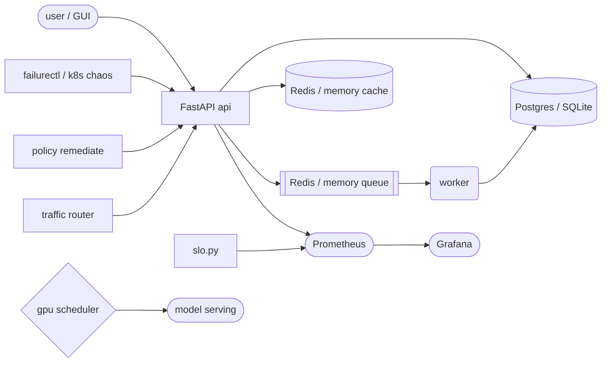

# 🧪 Infrastructure Reliability Lab


A hands-on distributed reliability platform in **Python + Go**: break things,
watch them, measure them, fix them — with evidence for every claim.

## ⚡ One-click start

**Double-click `Start Lab.bat`** — or run one command:

```
python lab_gui.py
```

That boots the API + worker (+ model serving) and opens the console:
service status lights, chaos injection, benchmarks+SLO, GPU/DR demos, live logs.

## 🗺️ Architecture



## 🧩 What's inside

| Area | Contents |
|---|---|
| `app/` | FastAPI API, worker, DB/cache/queue, metrics, OTEL tracing, JSON logs |
| `lab_gui.py` | One-click desktop console (stdlib only) |
| `failure-engine/` | `failurectl` CLI (latency/error/cpu) + kubectl scenarios |
| `slo-engine/` | SLO definitions + availability/p50/p95/p99 evaluator |
| `remediation-engine/` | Policy engine (cooldown, max-attempts, audit log) |
| `traffic-engine/` | Weighted router with health checks + failover |
| `dr-engine/` | DR drill runner with JSON reports |
| `gpu-scheduler/` + `model-serving/` | Real nvidia-smi placement + HTTP inference |
| `operator/` (Go) | ProductionService CRD + reconcile core (drift/scale/rollback) |
| `deploy/kubernetes/` | API, worker, Postgres, Redis, RBAC, NetworkPolicy |
| `observability/` | Prometheus rules, Grafana dashboard + datasource |
| `benchmarks/` | Load generator + measured report |
| `docs/` | [Full index](docs/README.md) — start with [PROJECT-REPORT](docs/PROJECT-REPORT.md) |

## 🚀 Quickstart (terminal)

```
pip install -r requirements.txt
uvicorn app.main:app --port 8000   # terminal 1
python -m app.worker               # terminal 2
pytest -q                          # 38 tests
```

Full stack: `docker compose up --build` (API :8000, Prometheus :9090, Grafana :3000).
Kubernetes: `make kind-up k8s-deploy` then `make k8s-chaos`.

## 📊 Measured highlights

- API: **194 RPS, p95 34ms, 100% availability** (`benchmarks/BENCHMARKS.md`)
- Pod-kill on kind: both API pods deleted → rescheduled in ~14s, traffic OK
- GPU inference (RTX 3070 Ti): **75 RPS, p50 15ms** after 6x telemetry-cache fix
- DR drill: PASS, 1034-row backup · Go operator: 5/5 tests

## 📄 License

MIT — see [LICENSE](LICENSE).
