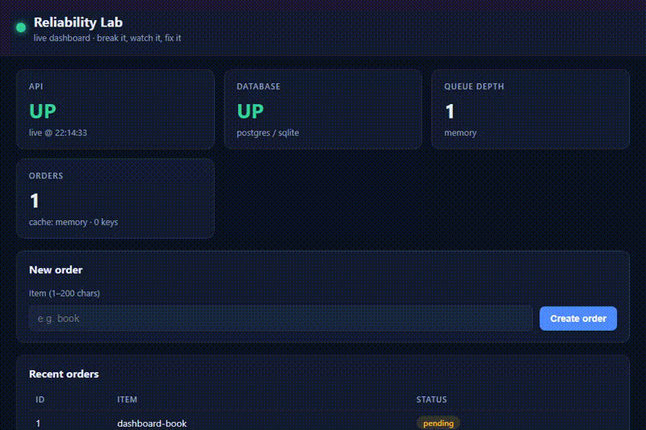
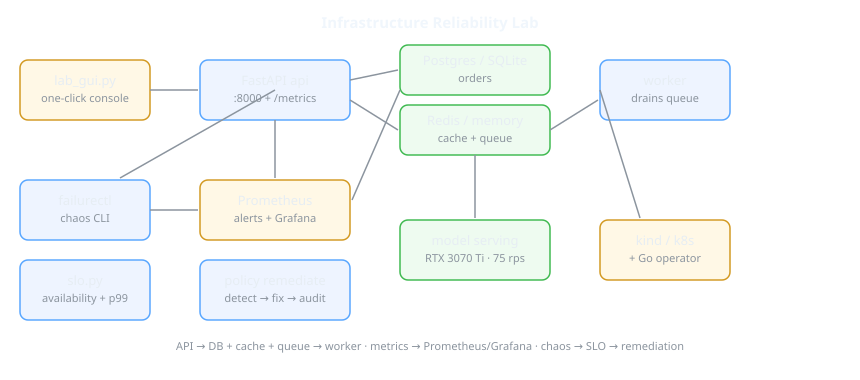
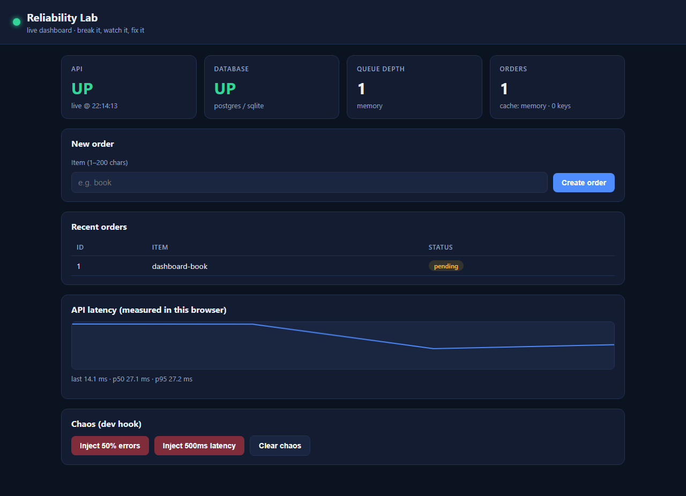
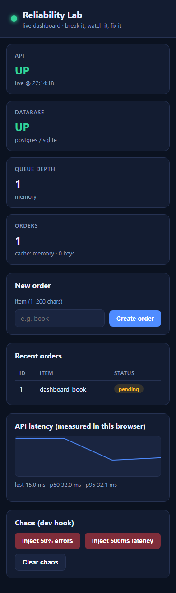
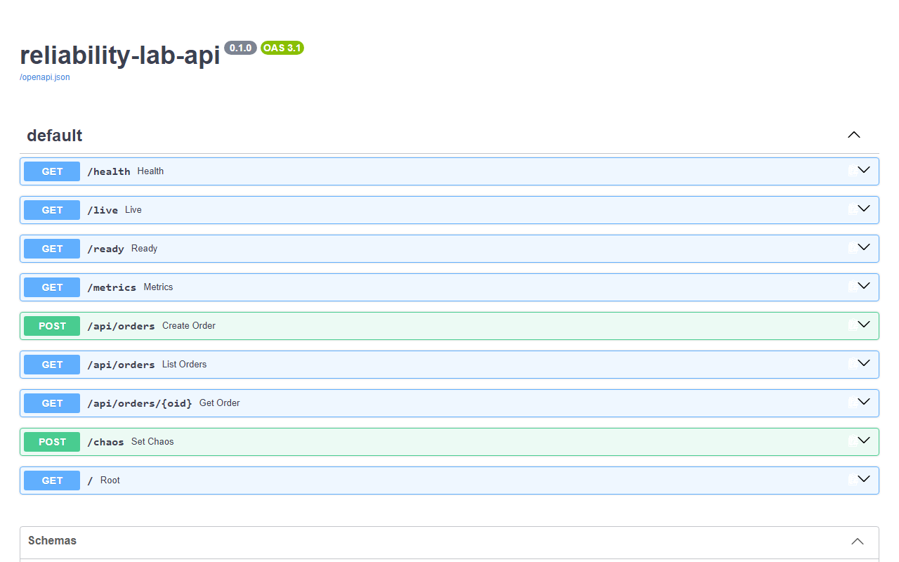
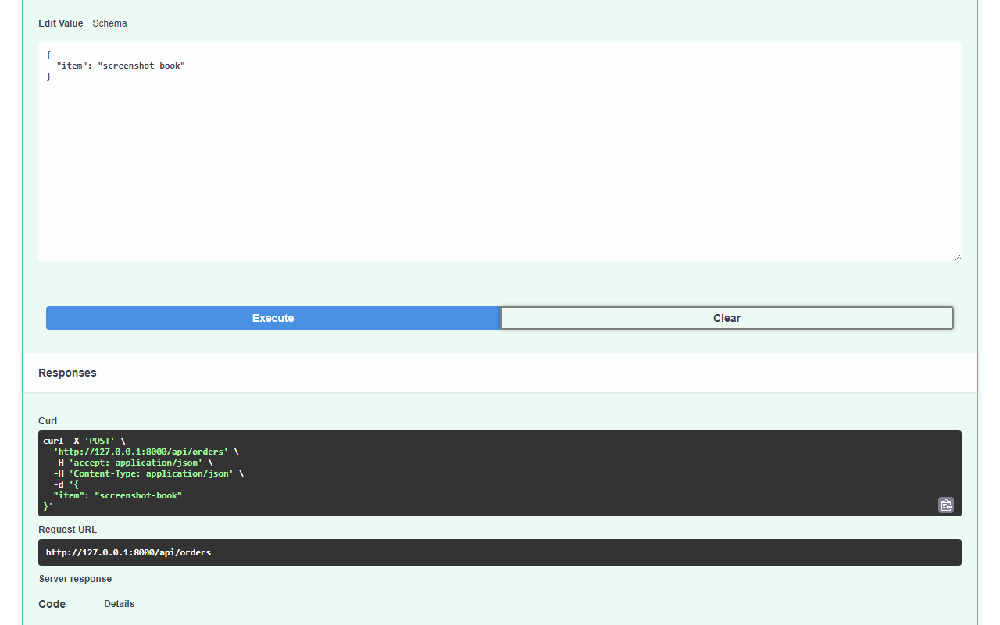
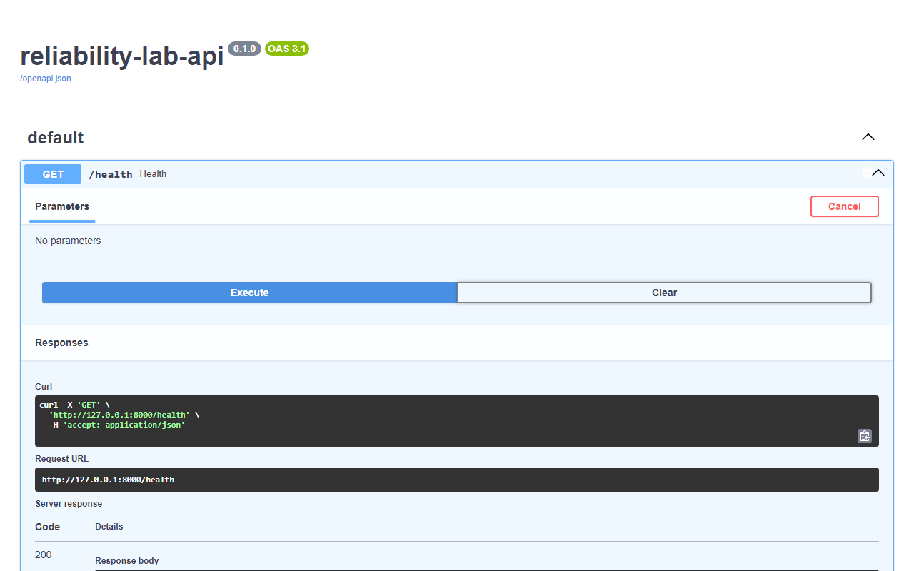
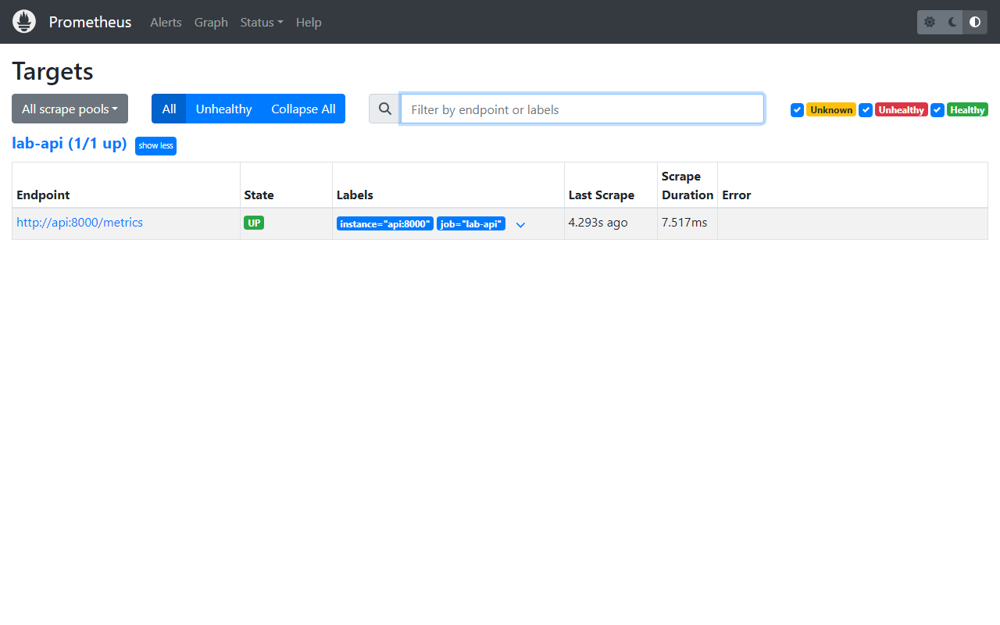
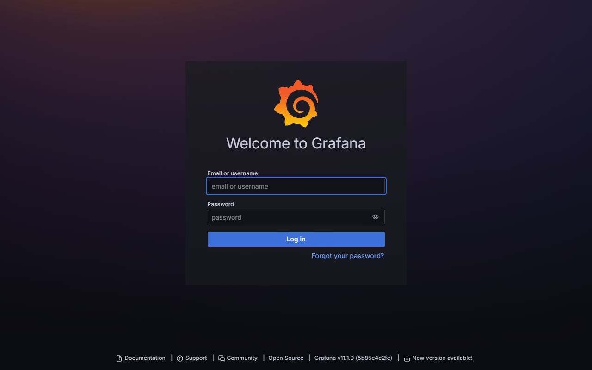

# Infrastructure Reliability Lab — Distributed Failure Engineering from Scratch

[](https://github.com/Kunal1Bhan/WORK_RES/actions/workflows/ci.yml) [](LICENSE)

**Infrastructure Reliability Lab** is a from-scratch distributed reliability platform in Python (+ a Go operator): a real FastAPI workload with Postgres/Redis, a chaos engine, SLO measurement, policy-driven remediation, DR drills, GPU model serving, and Kubernetes manifests — built milestone by milestone, with measured evidence for every claim.

> **Status:** All 13 milestones (M0–M13) complete and verified — 61/61 tests green,
> 194 RPS @ p95 34ms, pod-kill recovery on kind in ~14s, real RTX 3070 Ti
> inference at 75 RPS. See `docs/PROJECT-REPORT.md` for the full phase-by-phase record.
> Build order: `CHECKLIST.md`. Canonical spec: `SPEC.md`.





---

## Why Python (+ a Go operator, not Go everywhere)

The workload, chaos tooling, SLO math, and drills need maximum iteration speed and
zero build friction on a Windows dev machine — Python with FastAPI/SQLAlchemy wins
there, and SQLite/in-memory fallbacks mean the whole lab runs with no infrastructure.

The Kubernetes operator is Go because controllers belong to the `controller-runtime`
ecosystem: typed CRDs, code-generated clients, and a reconcile pattern reviewers
expect. Each language is used where its ecosystem is strongest; the boundary is the
`ProductionService` CRD in `operator/config/crd.yaml`.

- **Workload (`app/`)** — FastAPI + uvicorn; background worker; Postgres with
  SQLite fallback; Redis with in-memory fallback.
- **Console (`lab_gui.py`)** — stdlib-only tkinter; one click boots API + worker
  + model serving (no Electron, no new deps).
- **Operator (`operator/`)** — Go reconcile core (drift/scale/rollback/no-flap),
  unit-tested without a cluster.

---

## Architecture

```
                  ┌──────────────┐
                  │  lab_gui.py  │  one-click console
                  │  (tkinter)   │
                  └──────┬───────┘
                         │ start/stop + buttons
                         ▼
                  ┌──────────────┐        ┌──────────────┐
                  │ FastAPI api  │───────▶│   Postgres   │  or SQLite fallback
                  │ :8000        │        │   orders     │
                  └──────┬───────┘        └──────────────┘
                         │                ┌──────────────┐
                         ├───────────────▶│ Redis/memory │  cache + queue
                         │                └──────┬───────┘
                         │                       │ drain
                         │                ┌──────▼───────┐
                         │                │    worker    │  marks orders done
                         │                └──────────────┘
                         ▼
                  ┌──────────────┐        ┌──────────────┐
                  │  Prometheus  │───────▶│   Grafana    │  dashboard + alerts
                  │  :9090       │        │   :3000      │
                  └──────────────┘        └──────────────┘

  failurectl ──chaos──▶ api ◀──remediate── policy engine (cooldown + audit)
  loadtest ──traffic──▶ api ──JSONL──▶ slo.py (availability, p50/p95/p99)
  router ──weighted──▶ regions (health-checked failover)
  drill ──detect/evacuate/backup/promote/verify──▶ JSON report
  scheduler ──cuda:0──▶ model serving (RTX 3070 Ti, 75 RPS)
  operator (Go) ──ProductionService CRD──▶ kind/k8s
```

**Supporting doc:** `docs/ARCHITECTURE.md` is the canonical architecture reference.

---

## Quickstart

### Prerequisites

- **Python 3.12+** (3.13 tested), `pip`
- Optional: **Docker** (Compose stack), **kind + kubectl** (Kubernetes Gerald),
  **NVIDIA GPU** (else the `sim` provider is used)

### One-click console (recommended)

Double-click **`Start Lab.bat`** — or:

```
python lab_gui.py
```

Boots API + worker + model serving and opens the console: status lights, chaos
buttons, benchmark+SLO runner, GPU/DR demos, live logs. Closing it stops everything.

### Terminal (no Docker)

```
pip install -r requirements.txt
uvicorn app.main:app --port 8000   # terminal 1
python -m app.worker               # terminal 2
pytest -q                          # 61 tests
```

### One-command demo (Git Bash / Linux / macOS)

```
./scripts/demo.sh   # install → API + worker → seed → order → chaos → recover
```

### Docker Compose (full stack)

```
docker compose up --build -d
# API :8000 · Prometheus :9090 · Grafana :3000 (admin/lab)
```

### Kubernetes (kind)

```
make kind-up                       # kind create cluster --name lab
docker build -t lab-api:latest .
kind load docker-image lab-api:latest --name lab
make k8s-deploy                     # apply + wait for rollout
make k8s-chaos                      # delete API pods, watch them recover
```

### 60-second first chaos (local API running)

```
curl -s localhost:8000/health
python failure-engine/failurectl.py error --rate 0.5
curl -X POST localhost:8000/api/orders -H "Content-Type: application/json" -d "{\"item\":\"book\"}"
# expect: {"error":"injected failure"} with HTTP 500
python failure-engine/failurectl.py clear
```

The full guided tour (benchmarks → SLO → DR drill → GPU) lives in
`benchmarks/BENCHMARKS.md` and `docs/PROJECT-REPORT.md`.

### How this compares

| | Production platform (EKS + RDS + MSK…) | Real K8s + Prometheus | **This lab** |
|---|---|---|---|
| Goal | serve users | observe production | **education**: every layer runnable locally, fully measured |
| Workload | polyglot microservices | your apps | FastAPI + worker + PG/Redis |
| Chaos | Chaos Mesh / Litmus | manual | `failurectl` + kubectl scenarios |
| SLOs | vendor APM / Sloth | PromQL rules | alert rules + offline evaluator |
| Remediation | runbooks + on-call | Alertmanager hooks | policy engine with audit log |
| GPU serving | SageMaker / Triton | NVIDIA stack | nvidia-smi placement + CPU inference |
| Operator | Crossplane / custom | controller-runtime | reconcile core, CRD applied to kind |
| Cost to run | $$$ | cluster $ | **$0** (fallbacks need nothing) |

### Console / CLIs

```
python lab_gui.py                          # desktop console
python failure-engine/failurectl.py error --rate 0.5
python slo-engine/slo.py --log benchmarks/results-200rps.jsonl --target 99.9
python remediation-engine/remediate.py --dry-run --once
python benchmarks/loadtest.py --base http://127.0.0.1:8000 --rps 60 --seconds 20
python traffic-engine/router.py --regions http://localhost:8000 --port 8090
python dr-engine/drill.py --primary http://127.0.0.1:8000 --db lab.db
python gpu-scheduler/scheduler.py inventory
python model-serving/serve.py --port 8100
```

## 🖥️ Frontend

Two user surfaces, no framework: the **tkinter desktop console** (one-click
`Start Lab.bat`) and the **`/dashboard` web UI** served by the API
(dark theme, live cards, order form, latency sparkline, chaos panel),
plus auto-generated Swagger at `/docs`.

| Dashboard (desktop) | Dashboard (mobile, 390px, zero overflow) |
|---|---|
|  |  |


*Real recording: fill order form → submit → toast + table update → chaos on/off.
Console bugs fixed this pass: thread-safe widget updates, non-blocking close,
busy-state on long runs. Details: [`docs/frontend/architecture.md`](docs/frontend/architecture.md).*

---

## 📸 Screenshots

| API docs (Swagger) | Create order (201) | Order list |
|---|---|---|
|  |  |  |
| Prometheus targets | Grafana login | |
|  |  | |

## 🎬 Demo


*Real screen recording: expand POST /api/orders in Swagger → execute → 201 →
list orders. Captured with `python docs/capture.py` against the live stack.*

## 🔧 Environment variables

See [`.env.example`](.env.example) (copy to `.env`; never commit secrets).

| Var | Purpose | Default |
|---|---|---|
| `DATABASE_URL` | SQLAlchemy URL (`postgresql+psycopg://…` or `sqlite:///...`) | `./lab.db` |
| `REDIS_URL` | cache+queue backend (empty = in-memory) | empty |
| `POSTGRES_PASSWORD` | compose DB password (**required**, no default) | — |
| `API_KEY` | gates `/api/*` + `/chaos` via `X-API-Key` (empty = open) | empty |
| `CHAOS_ENABLED` | `0` disables `/chaos` entirely | `1` |
| `RATE_LIMIT_RPS` / `RATE_LIMIT_BURST` | per-IP token bucket (`0` = off) | `0` / `50` |
| `PAGE_SIZE_MAX` | list cap | `100` |
| `POOL_SIZE` / `POOL_MAX_OVERFLOW` | PG pool | `5` / `10` |
| `LOG_LEVEL`, `OTEL_ENABLED` | logging / tracing | `INFO` / `0` |

## 🗄️ Database

Schema auto-creates on startup (`init_db`) incl. additive index migration
(`ix_orders_status`, `ix_orders_created`). Fresh DB →
`python scripts/seed.py --items 8` → start API/worker. PG pool uses
`pool_pre_ping`; sessions always closed (rollback on error).

## 🧪 Testing

```
pytest -q            # 61 tests: unit + integration + real-process + browser E2E
ruff check .         # lint
python -m pip_audit -r requirements.txt
```
Details: [`docs/testing.md`](docs/testing.md). CI runs lint → tests (with
Postgres+Redis services) → audit → docker build.

## 🚢 Production deployment

Single-host Compose is the deployed architecture (verified: 6/6 healthy +
smoke green). Rationale, scaling, backup/rollback, monitoring, cost:
[`docs/deployment.md`](docs/deployment.md). No public-cloud deploy exists
(no cloud credentials here) — compose + k8s manifests are the artifacts.

## 🔒 Security

Optional API-key auth, chaos kill-switch, rate limiting, security headers,
request IDs, error envelopes (no stack traces to clients), non-root image,
RBAC + NetworkPolicy, `pip-audit` in CI. Audit + residual risks:
[`docs/SECURITY.md`](docs/SECURITY.md) and [`docs/AUDIT.md`](docs/AUDIT.md).
Report issues privately to the owner.

## 🩺 Monitoring & troubleshooting

Prometheus :9090 (4 rules: 5xx>5%, p95>500ms, queue>50, DB down), Grafana
:3000, `/live` (process), `/ready` (deps), `/metrics`. Common gotchas:
use `127.0.0.1` not `localhost` (IPv6 delay); missing `POSTGRES_PASSWORD`
fails fast; in-memory queue is per-process (use Redis across processes).

## Project status

```
Production Ready: YES (single-host Compose, with documented limitations)
E2E Tested: YES (real-process journey incl. failure paths)
Deployment: local Compose (6/6 healthy, smoke green); no public cloud (no creds)
```

---

## Repository Layout

```
app/                 # FastAPI API, worker, DB/cache/queue, metrics, OTEL, JSON logs
lab_gui.py           # one-click tkinter console (Start Lab.bat)
failure-engine/      # failurectl CLI + kubectl scenarios
slo-engine/          # slos.yaml + availability/latency evaluator
remediation-engine/  # policies.yaml + engine (cooldown, audit)
traffic-engine/      # weighted router with health checks
dr-engine/           # DR drill runner + reports
gpu-scheduler/       # nvidia-smi/sim placement
model-serving/       # HTTP inference + GPU telemetry
operator/            # Go ProductionService CRD + reconcile core + config
deploy/kubernetes/   # API, worker, Postgres, Redis, RBAC, NetworkPolicy
observability/       # Prometheus rules, Grafana dashboard + datasource
benchmarks/          # loadtest.py + measured BENCHMARKS.md
tests/               # 61 pytest tests (API, SLO, chaos, router, DR, GPU, GUI, browser…)
docs/                # REPORT, ARCHITECTURE, MILESTONES, ENVIRONMENT, DECISIONS…
```

---

## ⚠️ Windows Notes — Read Before Benchmarking

- **Always use `127.0.0.1`, never `localhost`, in scripts.** Python's `urllib`
  pays a ~2s IPv6-fallback penalty per connection to `localhost` on this host;
  it silently destroys benchmark numbers (documented in `benchmarks/BENCHMARKS.md`).
- **kindnet ignores NetworkPolicy.** Policies apply cleanly but enforcement is
  NOT MEASURED here — needs Calico.
- **`/chaos` is a dev-only hook.** Validated inputs, but put auth in front before
  any shared-cluster use.

---

## Further Reading

- `SPEC.md` — canonical technical spec (§1–§8)
- `CHECKLIST.md` — build phases with evidence links
- `PROMPT.md` — original project brief (historical)
- `docs/PROJECT-REPORT.md` — final validation: per-milestone verdicts + evidence
- `docs/ARCHITECTURE.md` — canonical architecture + dependency graph
- `docs/MILESTONES.md` — M0–M13 status table
- `docs/ENVIRONMENT.md` — probed host/tooling report
- `docs/FAILURE-MODEL.md` — scenarios, detection, recovery
- `docs/DECISIONS.md` — ADRs 001–005
- `docs/SECURITY.md` — audit results + hardening
- `benchmarks/BENCHMARKS.md` — measured numbers + limitations
- `ABOUT.md` — project profile in one page

---

## Contributing

PRs welcome — run `pytest -q` and `ruff check .` before pushing; keep the
evidence-first rule (every claim cites a test, a benchmark, or a captured run).
Report security issues privately to the repo owner.

## License

MIT — see [LICENSE](LICENSE).
